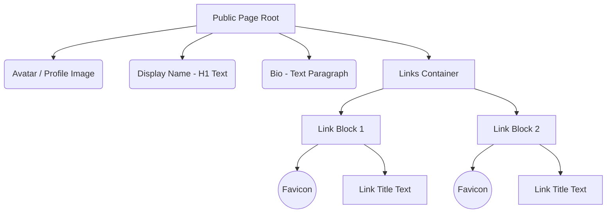
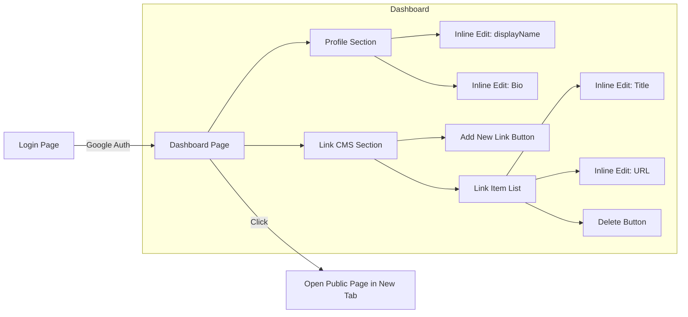

# 마이링크 (MyLink) 화면 설계서 (Wireframe)

- **작성일:** 2026-04-05
- **기준 PRD:** v1.3.0
- **디자인 시스템:** shadcn/ui 기반, 모바일 최적화 레이아웃

---

## 1. 퍼블릭 사용자 뷰 (Public View) - 모바일 기준

퍼블릭 뷰는 외부 사용자가 접근했을 때 보여지는 화면입니다. PC 접속 시에도 모바일 비율(고정 폭)로 화면 중앙에 배치됩니다.

### 🖼️ ASCII 아트 워이어프레임
```text
+-----------------------------------+
|                                   |
|        [ 구글 프로필 사진 ]       |
|                                   |
|          @displayName             |
|   "이곳은 한 줄 자기소개 텍스트"  |
|   "입니다. (클릭 시 확대 없음)"   |
|                                   |
|                                   |
|  +-----------------------------+  |
|  | (F) 블로그 링크 바로가기  > |  |
|  +-----------------------------+  |
|                                   |
|  +-----------------------------+  |
|  | (F) 유튜브 구독하기       > |  |
|  +-----------------------------+  |
|                                   |
|  +-----------------------------+  |
|  | (F) 포트폴리오 PDF 보기   > |  |
|  +-----------------------------+  |
|                                   |
|                                   |
|         Powered by MyLink         |
+-----------------------------------+
※ (F) = 구글 API로 자동 생성된 도메인 파비콘
```

### 🛣️ Mermaid 컴포넌트 흐름도


---

## 2. 홈 화면 및 로그인 (Landing View)

외부 방문자나 비로그인 사용자가 서비스 홈(`domain.com`)에 접속했을 때 나타나는 깔끔한 소개 및 진입 화면입니다.

### 🖼️ ASCII 아트 워이어프레임
```text
+---------------------------------------+
|  [로고] MyLink                        |
+---------------------------------------+
|                                       |
|    " 흩어진 당신의 모든 링크를        |
|      하나의 페이지로 묶어보세요. "    |
|                                       |
|     +---------------------------+     |
|     | [G] Google 계정으로 시작  |     |
|     +---------------------------+     |
|                                       |
|    [기능소개: 파비콘 자동화, 간편편집]   |
+---------------------------------------+
```

---

## 3. 관리자 대시보드 플로우 (Dashboard - Owner View)

소유자가 구글 로그인을 거쳐 진입하게 되는 링크 관리(CMS) 핵심 화면입니다.

### 🖼️ ASCII 아트 워이어프레임 (대시보드)

**[ 대시보드 관리 화면 ]**
```text
+-------------------------------------------------+
|  [로고] MyLink     [↗ 내 페이지 보기] [📋복사] [🚪아웃] |
+-------------------------------------------------+
|                                       |
|  내 프로필                            |
|  +---------------------------------+  |
|  | [구글프사]  닉네임: displayName✎|  |
|  |            소개말: bio 입력란✎  |  |
|  +---------------------------------+  |
|                                       |
|  링크 관리 (총 2개)                   |
|  +---------------------------------+  |
|  | (F) 제목: 블로그 바로가기 ✎     |  |
|  |     URL: https://blog.com ✎ [🗑]|  |
|  +---------------------------------+  |
|                                       |
|  +---------------------------------+  |
|  | (F) 제목: 제목입력 ✎            |  |
|  |     URL: URL입력 ✎          [🗑]|  |
|  +---------------------------------+  |
|                                       |
|  +---------------------------------+  |
|  | [+] 새 링크 항목 추가하기       |  |
|  +---------------------------------+  |
|                                       |
+---------------------------------------+
※ '✎' 표시가 있는 곳은 클릭 즉시 인라인 수정(Inline Edit)이 되는 텍스트 필드입니다.
```

### 🛣️ Mermaid 화면 및 로직 관계도

